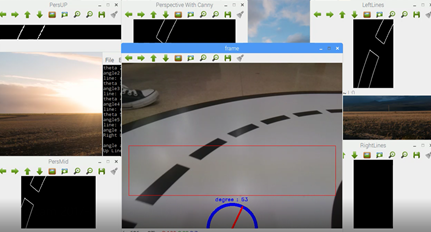
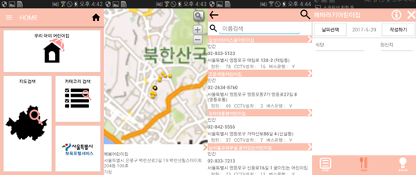

# Portfolio

- 개인 포트폴리오를 작성하였습니다. 중요한 내용에는 Bold 처리를 하였습니다.

---

### Contact.

**Email.** 201211211yj@gmail.com

**Phone.** 010-0000-0000

### Channel.

**GitHub.** [https://github.com/201211211yj](https://github.com/201211211yj)

---

## Skills.

- 언어 : **Java**, Java Script, C++
- Framework : **Spring Boot, Spring Framework**, Android, vue.js
- ETC : Linux, OpenCV,

---

## Careers.

**2012.03 ~ 2018.02 / OO대학교 컴퓨터과학 심화전공 졸업**

**2018.01 ~ / SI업체 재직 (OO화재 업무포탈 운영)**

---

## Major Projects.

### StackStock (2020~)

Spring Boot Webflux 기반의 대용량 비동기 데이터 처리를 통한 주식 예측 프로그램을 개발하고자 하였습니다. **Webflux와 기존의 동기적 MVC와의 성능 비교 및 장/단점 학습**이 주 목적인 프로젝트입니다.

**Git Repository.** 

- StackStock Crawler ([https://github.com/201211211yj/StackStockCrawler](https://github.com/201211211yj/StackStockCrawler))
    - WebClient를 통한 비동기 주식 크롤러입니다.
    - 축적된 데이터는 MongoDB에 쌓이게 되어있습니다.
- StackStock Rest API ([https://github.com/201211211yj/StackStockRouter](https://github.com/201211211yj/StackStockRouter))
    - WebFluxConfigurer를 통해 축적된 데이터를 처리할 수 있는 Rest API를 구현하였습니다.

**Tech Skills.**

- Front-End
    - vue.js (예정)
- Back-End
    - Java
    - Spring Boot (학습 내용 : [https://github.com/201211211yj/Spring-Boot-Start](https://github.com/201211211yj/Spring-Boot-Start))

## Etc Projects.

### 자율주행 모듈 (2017.06 ~ 2017.09 完)

IOT Innovation Challange 본선에서 쓰인 프로그램으로 Artik710을 활용한 자율주행 모듈입니다. 

차선 인식을 위해 OpenCV를 활용하였으며 **Canny, Houghlines 등의 알고리즘을 조합**하여 사용하였습니다. 차선 인식률은 약 70%로 대부분의 트랙에 완주가 가능했습니다.

**Git Repository.** ([https://github.com/201211211yj/Artik710AutoCar](https://github.com/201211211yj/Artik710AutoCar))

**Tech Skills.**

- **자율 주행 기능 (담당 업무)**
    - **Linux**
    - **C++**
    - **OpenCV**
- 수동 주행 기능
    - Android
    - Java

## 어린이집 어플리케이션 (2016.07 ~ 2016.08 完)

학부시절 안드로이드 개발 학습용으로 개발한 어플리케이션입니다. 

서울시 공공데이터를 기반으로 어린이집 위치, 정보 조회, 식단 등록 등 간단한 기능을 개발하였습니다. 어플리케이션의 동작은 정상적으로 이루어지나, 소스코드의 구조화는 미흡하게 완성되었습니다.

**Git Repository.** ([https://github.com/201211211yj/2016SeoulApp](https://github.com/201211211yj/2016SeoulApp))

**Tech Skills.**

- **기본 기능**
    - **Java**
    - **Android**
    - **MySQL**

---
